# AWSDevOpsTutorial
Unbreakable DevOps Pipeline Tutorial with AWS CodeDeploy, AWS CodePipeline, AWS Lambda, EC2 and Dynatrace.

The goal of this tutorial is having a full end-to-end AWS DevOps Pipeline (Staging, Approval, Production) that is fully monitored with Dynatrace. With Dynatrace injected into the pipeline you get the following features
1. Monitor your Staging Environment
2. Automate Approve/Reject Promotion from Staging to Production based on Performance Data
3. Monitor your Production Environment
4. Automatic Deploy of previous revision in case Dynatrace detected problems in Production

Before we launch the CloudFormation stack which will create all required resources (EC2 Instances, Lambdas, CodeDeploy, CodePipeline, API Gateway) lets make sure we have all pre-requisits covered!

## Pre-Requisits
1. You need an AWS account. If you dont have one [get one here](https://aws.amazon.com/)
2. You need a Dynatrace Account. Get your [Free SaaS Trial here!](http://bit.ly/dtsaastrial)
3. You need to clone or copy the content of this GitHub repo to your local disk!

## Preparation
**Amazon**
As we are going to use AWS CodeDeploy, AWS CodePipeline, AWS Lambda, DynamoDB, API Gateway and EC2 make sure the AWS Region you select provides all these services. We have tested this cloud formation on US-West-2a (Oregon) and US-East-2b (Ohio). To be on the safe side we suggest you pick one of these regions!

1. Create an EC2 Key Pair for your AWS Region! Our CloudFormation Template needs an EC2 Key Pair!
1.1. To learn more about Key Pairs and how to connect to EC2 Instances for troubleshooting read [Connect to your Linux Instance](https://docs.aws.amazon.com/AWSEC2/latest/UserGuide/AccessingInstances.html)
2. Create a S3 Bucket with the naming scheme: <yourname>-dynatracedevops and enable versioning. See following screenshots for reference

3. Copy the content from the folder "copytos3" to your newly created S3 bucket. This includes the application package, tests, monspec as well as all Lambda functions


**Dynatrace**
We need a couple of things to launch the CloudFormation Template
1. Your *Dynatrace Tenant URL*: For SaaS that would be something like http://<yourtenant>.live.dynatrace.com. For Managed it would be http://<yourserver>/e/<your-env-id>
2. Your *Dynatrace OneAgent for Linux Download URL*: Go to Deploy Dynatrace -> Start Installation -> Linux and copy the URL within the quotes as shown below:

3. A *Dynatrace API Token*: Go to Settings -> Integration -> Dynatrace API and create a new Token


Almost there: We need to execute one mandatory and one option configuration step!
1. *Dynatrace Automatic Tag Rules*
For Dynatrace to automatically distinguish between a Staging and a Production version of a Microservice we leverage what is called "Rule-Based Tagging". AWS CodeDeploy will pass on the Deployment Stage Name (Staging and Production) as an environment variable to the EC2 machine. Dynatrace will automatically pick up these environment variables but doesnt do anything with them unless we specify a rule that extracts this variable and applies it to the microservice monitoring entities. 
Please go to *Settings -> Tags -> Automatically applied tags* and add a new rule as shown in the next screenshot:
- Call the rule DeploymentGroup
- Specify the rule for Services
- In Optional Tag Value add: {ProcessGroup:Environment:DEPLOYMENT_GROUP_NAME}
- You can leave the condidtion with the default values as you wont be able to select the condition shown in my screen until Dynatrace has seen that Environment variable. We can come back here later and add the condition!

2. (Optional) Setup AWS CloudWatch Monitoring
Dynatrace has a built-in feature to pull in metrics and metadata (e.g: tags ) from CloudWatch. You can setup this integration as explained in the documentation: [How do I start Amazon Web Services monitoring?](https://www.dynatrace.com/support/help/cloud-platforms/amazon-web-services/how-do-i-start-amazon-web-services-monitoring/)


## 1. Lets create the CloudFormation Stack
If you haven't cloned or downloaded the full GitHub repo then download the CloudFormation stack definition from [here](./AWSDevOpsTutorialCloudFormationStack.json).

Now click on one of the regional links. This brings you to the CloudFormation Web Console where you can upload your downloaded CloudFormation Stack Definition.

Region | Launch Template
------------ | -------------
**N. Virginia** (us-east-1) | <a href="https://console.aws.amazon.com/cloudformation/home?region=us-east-1#/stacks/new?stackName=dynatracedevopsstack" target="_blank">Launch Dynatrace DevOps Stack into Virginia</a>
**Ohio** (us-east-2) | <a href="https://console.aws.amazon.com/cloudformation/home?region=us-east-2#/stacks/new?stackName=dynatracedevopsstack" target="blank">Launch Dynatrace DevOps Stack into Ohio</a>
**Oregon** (us-west-2) | <a href="https://console.aws.amazon.com/cloudformation/home?region=us-west-2#/stacks/new?stackName=dynatracedevopsstack" target="blank">Launch Dynatrace DevOps Stack into Oregon</a>
**Ireland** (eu-west-1) | <a href="https://console.aws.amazon.com/cloudformation/home?region=eu-west-1#/stacks/new?stackName=dynatracedevopsstack" target="blank">Launch Dynatrace DevOps Stack into Ireland</a>
**Frankfurt** (eu-central-1) | <a href="https://console.aws.amazon.com/cloudformation/home?region=us-central-1#/stacks/new?stackName=dynatracedevopsstack" target="blank">Launch Dynatrace DevOps Stack into Frankfurt</a>
**Tokyo** (ap-northeast-1) | <a href="https://console.aws.amazon.com/cloudformation/home?region=ap-northeast-1#/stacks/new?stackName=dynatracedevopsstack" target="blank">Launch Dynatrace DevOps Stack into Tokyo</a>
**Seoul** (ap-northeast-2) | <a href="https://console.aws.amazon.com/cloudformation/home?region=ap-northeast-2#/stacks/new?stackName=dynatracedevopsstack" target="blank">Launch Dynatrace DevOps Stack into Seoul</a>
**Singapore** (ap-southeast-1) | <a href="https://console.aws.amazon.com/cloudformation/home?region=ap-southeast-1#/stacks/new?stackName=dynatracedevopsstack" target="blank">Launch Dynatrace DevOps Stack into Singapore</a>
**Sydney** (ap-southeast-2) | <a href="https://console.aws.amazon.com/cloudformation/home?region=ap-southeast-2#/stacks/new?stackName=dynatracedevopsstack" target="blank">Launch Dynatrace DevOps Stack into Sydney</a>

### Step 1: Upload your File and click next


### Step 2: Define all your input parameters


### Step 3: Click through all other wizard steps. Confirm the box and click CREATE


### Step 4: Refresh that screen and watch CloudFormation create resources


### Step 5: Once Done. Check outputs


## Lets explore what has been created
Several things have been created.

### CodePipeline

Go to AWS CodePipeline and validate that you see this new pipeline


Even though the Pipeline already executed we want to run it again. Click on "Release change" to run it again. This is due to some timing isuses when CodePipeline runs immediately after CloudFormation created it


The Pipeline will deploy an application into staging, run some tests and already lets Dynatrace know about these deployments. It will also register a build validation run with Dynatrace (we will learn more about this later).

Let the pipeline run until it reaches the *Approve Staging* stage. For now we manually approve the Pipeline.


The Pipeline will continue to deploy our application in Production, will run some tests (well - thats more like simulating real user load) and will also let Dynatrace know about that deployment.

The last step in the Pipeline is to approve that Production Deployment was good. This is again a manual process for now!

### Our Deployed Application

As the Pipeline did its job we should be able to navigate to our deployed application in Staging and Production. You saw the Public DNS for our two server instances in the CloudFormation Output. If you dont remember either go back to the CloudFormation overview or navigate to your EC2 Instances. You will see both instances there and you can also get to the Public DNS and also Public IP.


If we take the public IP or public DNS we simply put it in a browser and navigate to default port 80. Lets see whether our app is up and running!


GRANTED - not the most beautiful looking app, but it does its job :-)

### Our Deployed Application in Dynatrace

Behind the scenes a Dynatrace OneAgent was deployed on these EC2 Instances automatically starting to do FullStack monitoring of these instances. 

*Host Monitoring*
In your Dynatrace Web UI click on Hosts. You will see all hosts currently monitored. Click on one of them to get into the details. If you have also configured the [Dynatrace AWS CloudWatch Integration](https://www.dynatrace.com/support/help/cloud-platforms/amazon-web-services/how-do-i-start-amazon-web-services-monitoring/) you also see the tags configured in AWS on your EC2 instances as well as AWS CloudWatch Metrics.


*Service Monitoring*
When CodeDeploy deployed the app it also pushed some additonal environment variables to the Node.js process, telling Dynatrace more about the actual application and services. Here is part of the start_server.sh script that CodeDeploy executes. You see that we are leveraging our DT_TAGS, DT_CUSTOM_PROP and DT_CLUSTER_ID. If you want to learn more about tagging options start with this blog post: [Automate the tagging of entities with environment variables](https://www.dynatrace.com/blog/automate-tagging-entities-environment-variables/)
```
export DT_TAGS=APPLICATION_NAME=$APPLICATION_NAME
export DT_CUSTOM_PROP="DEPLOYMENT_ID=$DEPLOYMENT_ID DEPLOYMENT_GROUP_NAME=$DEPLOYMENT_GROUP_NAME APPLICATION_NAME=$APPLICATION_NAME"
export DT_CLUSTER_ID="$DEPLOYMENT_GROUP_NAME $APPLICATION_NAME"
```

If you browse to your Dynatrace Web UI and then select Transaction & Services you will see the two detected services with their correct names and also the environment they run in (Staging or Production)


Lets click on the Staging Service and explore what Dynatrace sees within that service:


The longer you run the more historical data we have. But we already see Response Time, Failure Rate, Throughput. We see where the Node.js service runs on and we also get all the deployment information from the AWS CodePipeline. If you want to learn more about how to explore this data from here, e.g: see down to method level, exceptions, ... then check out our YouTube Dynatrace Performance Clinic on [Basic Diagnositcs with Dynatrace](https://www.youtube.com/watch?v=OEGk4JN9wDg&list=PLqt2rd0eew1YFx9m8dBFSiGYSBcDuWG38&index=2&t=810s)

## 2. Lets run another CodePipeline

To simulate a new pipeline run lets go back to our AWS CodePipeline and click on "Release change". This will trigger a new release of the current build. Once the Pipeline reaches the Approval Phases manually aprove it. 

### Validate Dynatrace Deployment Event

Everytime a deployment happens from our Pipeline we should see that information on the service that Dynatrace monitors. Lets go back to one of the services (Staging or Production) and explore the 


### Explore Performance Data per Pipeline Run

In a "non automated" world the approver of a build would go off to all sorts of tools, e.g: CodeCoverage, Unit & Functional Test Results, Load Testing Results and Monitoring Tools. In our case we could for instance open up the Dynatrace Dashboards for our Staging service and see how Response Time, Failure Rate and Throughput compares to e.g: current state in production or the timeframe of the previous test. In Dynatrace we could for instance create a chart that compares Staging vs Production Response Time and based on that decide whether to approve the Staging phase:
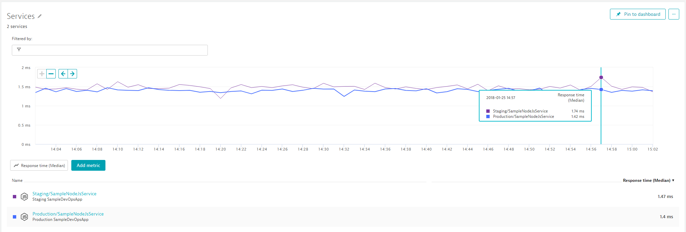

**BUT THAT IS A BORING TASK!! A TASK THAT CAN BE AUTOMATED!!**

In our AWS CodePipeline you may have noticed an action called *RegisterDynatraceBuildValidation*. This action triggers the Lambda function *registerDynatraceBuildValidation* with the parameters: StagingToProduction,5. These parameters tell our Lambda function to that we want to compare key metrics from Staging vs Production. It also tells it that we dont want to do it right away but start in 5 minutes. Reason for that is because we first want to give the load test the chance to generate some load.

*registerDynatraceBuildValidation*: This AWS Lambda is actually not doing a whole lot. It is simply putting a "Build Validation Request" in a DynamoDB table with all the information needed to process the request once the timespan, e.g: 5 minutes has passed. If you want go ahead and explorer your DynamoDB table called *BuildValidationRequests*:
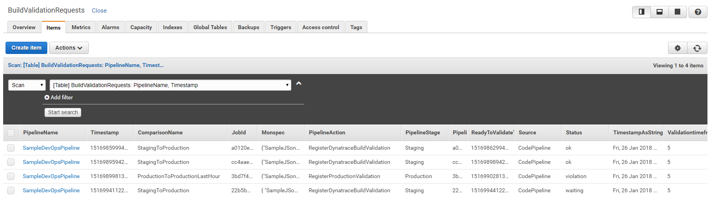
The key data points in that table are: PipelineName, ComparisonName, Timestamp, Validationtimeframe and Status. In my screenshot you can see that 4 build validation requests have already been validated and they all showed a Violation, meaning: the automated metrics comparison between the two specified environments showed a degradation in performance. I have one entry in there in status waiting. Waiting means that it is not yet time as the timeframe, e.g: 5 minutes since the request was put into this table has not yet passed!

*validateBuildDynatraceWorker*: This AWS Lambda is doing all the heavy lifting. It gets triggered via a CloudWatch Rule that calls this function every 2 minutes. The function checks the DynamoDB table and processes those entries that are in status "Waiting" and where "the time is right". The function then looks at the monspec file which contains the definition of environments, comparison configurations as well as metrics. Based on that configuration data the function uses the Dynatrace Timeseries API and pulls in the metrics from the entities and compares them. The result gets put back onto the DynamoDB Item. The monspec column contains all values from the source and the comparison source as well as status information for every compared metric and an overall status. The overall status is also reflected in the Status column.
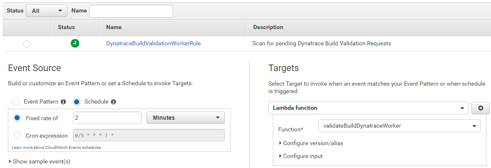

So - one way to look at the data would be to go back to the DynamoDB table and manually look at the Monspec column. **BUT - THAT IS ALSO BORING AND A MANUAL TASK!!**

*getBuildValidationResults*: This brings us to this AWS Lambda function which allows us to query build validation information and get it presented in a "nice" HTML page (I have to admit - I am not a Web Frontend Guru - this is the best I could come up with). 
To easier acces this AWS Lambda function, our CloudFormation stack created an API Gateway with a public method. If you go back to your CloudFormation Output you should see one output with the name *DynatraceBuildReportEndpoint*. It should say something like this: https://abcdefgh.execute-api.us-west-2.amazonaws.com/v1/BuildValidationResults
Go ahead and open it - the report gives you a list of metrics and for every build these metrics got evaluated we see the values from our Source System (e.g: Staging), the Comparison System (e.g: Production), the allowed calculated Threshold and whether the current value Violated the threshold!
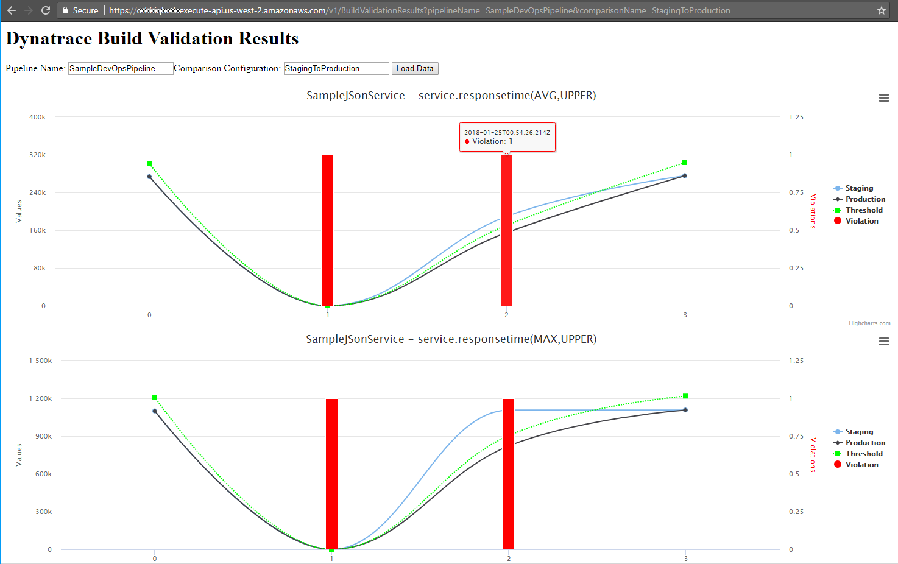

Alright. So - we now have automated performance data from our Staging Enviornment that gets automatically compared to our Production environment every time we run a build. We have all this data in DynamoDB and accessible as an HTML report.

## 3. Lets automate the Approval Stage through Dynatrace

Now lets automate the approval of the "Manual Approval" action in our CodePipeline. Our Lambda function *validateBuildDynatraceWorker* which gets executed via the CloudWatch Rule is not only validating the results and writing it back to DynamoDB. It also checks whether the Pipeline that initiated that build validation request is currently waiting for Manual Approval. If that is the case, and if that Manual Approval WANTS *validateBuildDynatraceWorker* to approve/reject that phase then the Lambda function will do that as well.
The only configuration we have to do is to mark the "Manual Approval" so that our Lambda functions knows it can approve/reject it. This is done via the Comment field. Here our Lambda function expects the CodePipeline Action Name that initiated the build validation request. In our case that is *RegisterDynatraceBuildValidation*. 
Do do this lets edit our AWS CodePipeline and edit the ManualApproval action in the ApproveStaging stage of our Pipeline: RegisterDynatraceBuildValidation
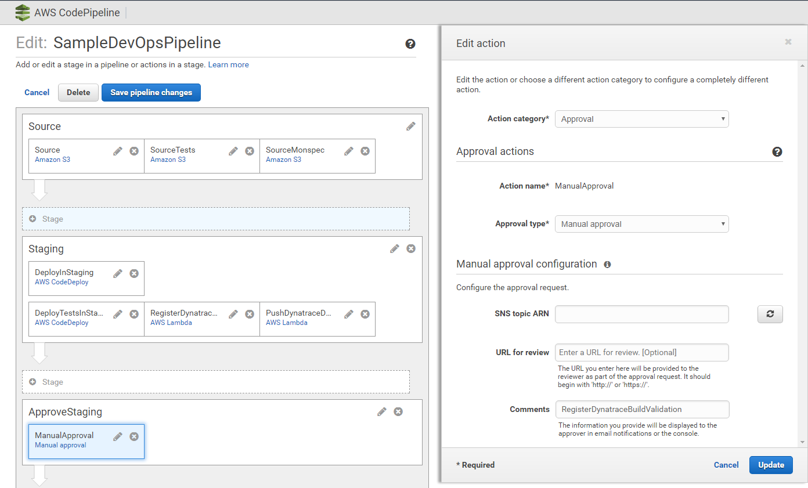

We can do the same for the Production Approval Stage as we also have a Build Validation Request right after we deploy production. That request validates Production with Production from an hour ago - making sure that nothing that was deployed is worse than before. Here is the configuration of the RegisterProductionValidation action right after we deployed the application in Production. It puts a Build Validation Request into our DynamoDB table to validate Production with ProductionLastHour, 5 minutes into the Production Deployment!
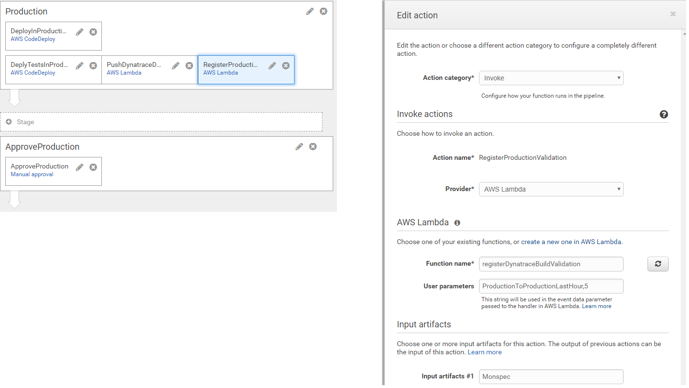

In order to automatically validate the Production Approval Stage we simply do the same thing we did for our Staging approval. We put *RegisterProductionValidation* into the Comments field:
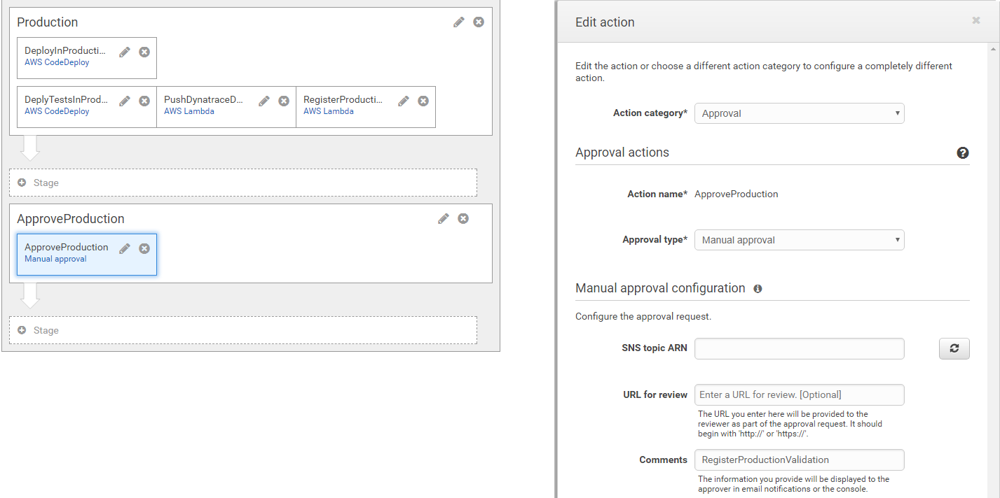

THATS IT!!! - From now on our pipeline approvals will automatically be accepted or rejected based on Dynatrace Build Validation Results. We can always manually approve these actions BEFORE Dynatrace gets to - but - well - whats the point in automating then? :-)
In case Dynatrace Accepts or Rejects the Approval Stage you will find details about it on the Action itself. In case it fails the details also include the link to your report. Here is an example:


### Deploy a "bad" version into Staging

Our Sample app is not just a static app. It actually supportes "different builds" where every build lets the app experience different performance behavior. A great way to test our pipeline.
By default the app runs with *Build 1*. Build number is passed as an environment variable when CodeDeploy launches the app. Check out *start_server.sh* where we pass the env-variable:
```
export BUILD_NUMBER=1
```

We can pass other build numbers. Supported values are 1, 2, 3 and 4. Any other value defaults to 1. Here is a quick overview of how each build behaves:
Build # | Problem
------------ | -------------
1 | no problem
2 | 50% of requests return HTTP 500 Status Code
3 | back to normal
4 | no problem in staging but problem in prod -> higher sleep time and 10% of requests fail

Here are my suggestions for your next steps:
1. Try Build 2 and see whether the automated approval for Staging actually rejects the build. It should becuase 50% of requests fail which means that Failure Rate should show a violation as compared to Production.
2. Then try Build 3. Everything should be good again and the pipeline should make it all the way to Production
3. Now we can try Build 4. It should make it through Staging as the problem only affects Production Deployments. But we should see Production Approval to fail!
4. Lets go back to Build 1

### How to deploy one of these builds?

The GitHub repo contains a directoy called appbuilds_readytodeploy. In this directory you find 4 zip files of the appp. The only difference in each zip file is that the BUILD_NUMBER is set to either 1, 2, 3 or 4.
If you want to deploy a build simply take one of these zip files, rename it app.zip and upload it to your S3Bucket where you initially uploaded the app.zip file. Overwrite the existing version.
Now go to your AWS CodePipeline and click on "Release Change". Thats it!

## 4. Lets implement Self-Healing through Dynatrace and AWS Lambda

Last step in our tutorial is to automate handling a problem in production. Besides doing our Production Approval stage where we compare key metrics against a previous timeframe, Dynatrace provides a much smarter way to detect production problems. Dyntrace baslines every single metric for us, it also keeps an eye on critical log messages, end user behavior and infrastructure issues. In case a problem comes up that impacts our end users or service endpoints a new Problem Ticket gets created. The following ticket is an example if you deploy a bad build. Dyntrace automatically detects that something is wrong with our production service:
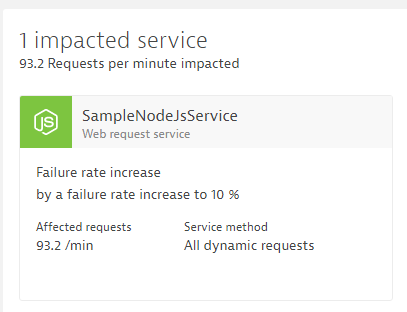
Clicking on the details shows us how and when Dynatrace detected that problem:
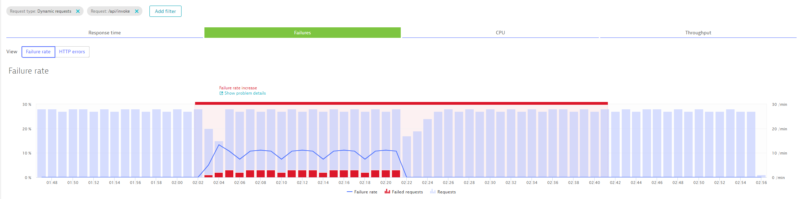

### Dynatrace Problem Notification

Everytime a problem ticket is opened Dynatrace can notify external tools, e.g: ServiceNow, PagerDuty, xMatters, JIRA, AWS API Gateways, ... about this problem. For our purposes we can let Dynatrace call an AWS Lambda function that we expose through a public API Gateway. Our CloudFormation Stack already created that endpoint for us. Go back to your CloudFormation Output list and find the link for the output *HandleDynatraceProblemEndpoint*. It shoudl be something like: https://abcdefgh.execute-api.us-west-2.amazonaws.com/v1/HandleDynatraceProblem

**Alerting Profiles**
In Dynatrace we can now configure our Problem Notification Integration to always call that endpoint in case a problem is detected. But instead of pushing ALL problems to this endpoint we can configure a so called "Alerting Profile" which allows us to only notify in case certain events happen on certain entities. In our case we only want to push Problems that happen in our Production Environment to this endpoint. In Dynatrace go to Settings - Alerting - Alerting Profiles and lets create a new Profile called ProductionService. In that profile we are only intersted in Error, Slowdown and Custom Alerts for those entities that have the DeploymentGroup:Production tag on it. So - thats our services that are deployed by CodeDeploy and where that environment variable is passed:
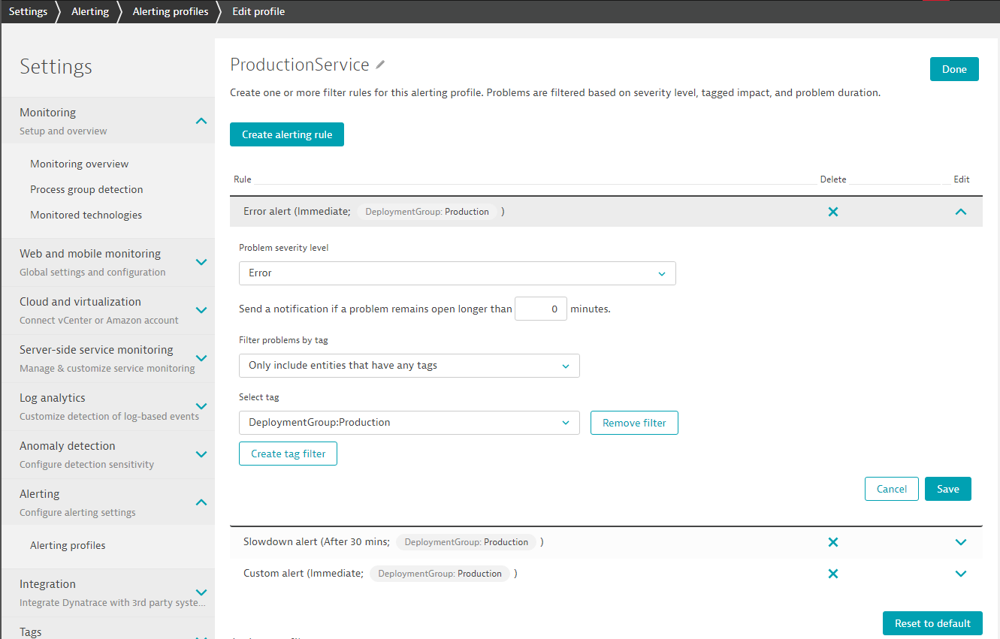

**Problem Notification with AWS Lambda**
No that we have our Alerting Profile we can go ahead and actually setup the integration. In Dynatrace go to Settings - Integration - Problem notification. Click on "Set up notifications" and select "Custom Integration".
Configure your integration as shown in the next screenshot. Give it a meaningful name. Then put in your HandleDynatraceProblem endpoint and click on Test Notification to test it out:
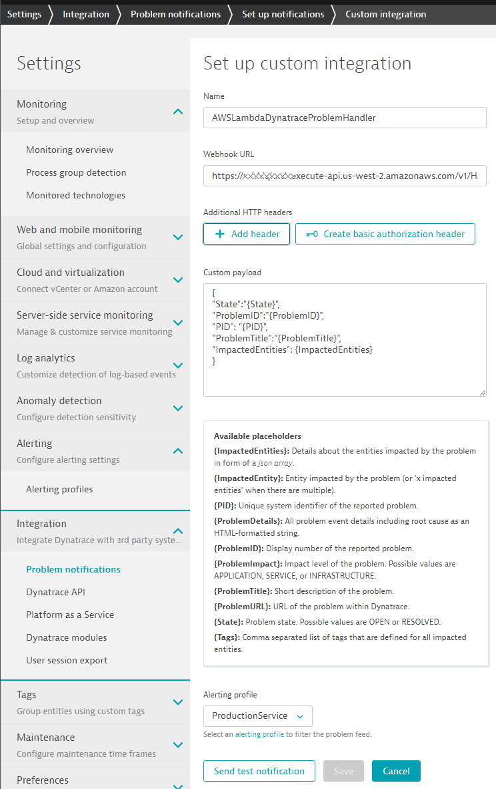

AND THATS IT - seriously! :-)

### Self-Healing AWS Lambda Function

Now - what is this AWS Lambda function actual doing?
*handleDynatraceProblemNotification*: This lambda functions queries the Dynatrace Problem REST API to capture more data about the impacted entities. In case the Problem was detected on an Entity where an AWS CodeDeploy Deployment was logged as a Deployment Event the function will figure out the previous AWS CodeDeploy Revision and initiate a deployment of that revision. This should then bring the system back into its previous state!

If you want to learn more about Self-Healing and Auto-Remediation I suggest you check out some of our material online. Deploying a previous revision is obviously just one easy remediation action. We could query the Dynatrace Timeseries API to figure out what else is going on in the system and e.g: scale up EC2 instances in case of traffic peaks or stop/promote BLUE/GREEN deployments in case we detect problems with one or the other version:
* [Blog: Auto-Mitigation with Dynatrace AI – or shall we call it Self-Healing?](https://www.dynatrace.com/blog/auto-mitigation-with-dynatrace-ai-or-shall-we-call-it-self-healing/)
* [YouTube Self-Healing Demo with our Lab Team: Auto-Scaling and Restarting Sevices](https://www.youtube.com/watch?v=0zlCxVEf8pk&list=PLqt2rd0eew1YFx9m8dBFSiGYSBcDuWG38&index=18)
* [Blog: Top Problems Detected and how to Auto-Mitigate them](https://www.dynatrace.com/blog/applying-dynatrace-ai-into-our-digital-performance-life-best-of-december-2017/)

If you have any further questions dont hesitate to ask!